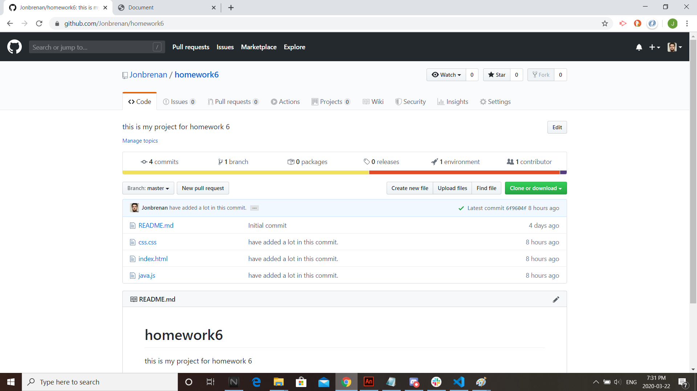
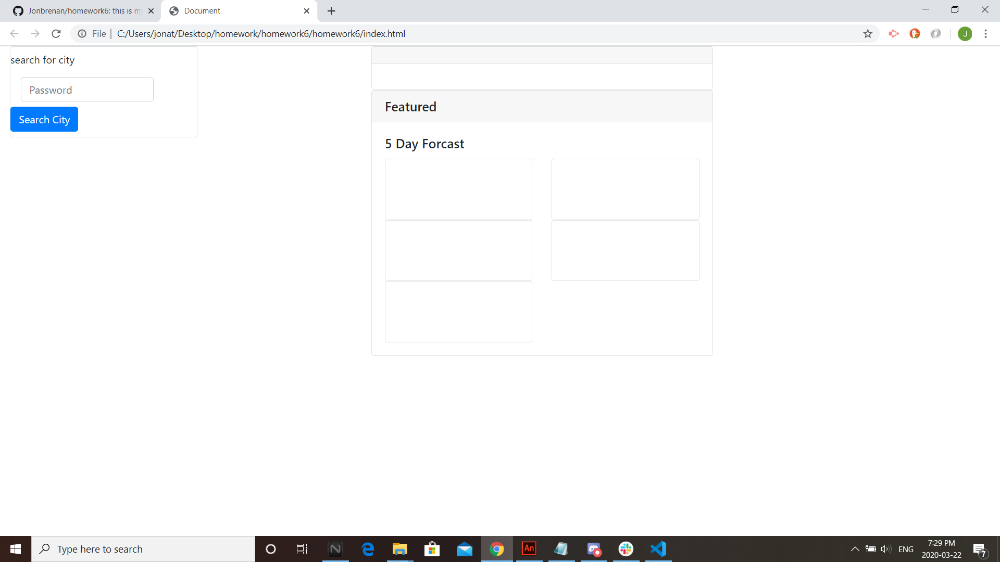

# homework6
this is my project for homework 6

This application serves to gather weather information for a particular location. Specificially, it provides
the weather info on the current day and a five day forcast for the city entered into the search bar.

An extra feature is that the UV Index will have a colored coded background that lets the user know if there is a
low, medium or high level of UV rays in area.

A second feature is that all cities that are searched for are kept in a dynamically forming list. Initially, if any
of these buttons were clicked, it would show the weather information for that city. The information for this was supposed
to be in local storage, however I could not find a solution for this.

Installation

to install the application, one would go to the github link provoided in this README, download the link and run.
link: https://github.com/Jonbrenan/homework6

License

MIT License

Copyright (c) [year] [fullname]

Permission is hereby granted, free of charge, to any person obtaining a copy
of this software and associated documentation files (the "Software"), to deal
in the Software without restriction, including without limitation the rights
to use, copy, modify, merge, publish, distribute, sublicense, and/or sell
copies of the Software, and to permit persons to whom the Software is
furnished to do so, subject to the following conditions:

The above copyright notice and this permission notice shall be included in all
copies or substantial portions of the Software.

THE SOFTWARE IS PROVIDED "AS IS", WITHOUT WARRANTY OF ANY KIND, EXPRESS OR
IMPLIED, INCLUDING BUT NOT LIMITED TO THE WARRANTIES OF MERCHANTABILITY,
FITNESS FOR A PARTICULAR PURPOSE AND NONINFRINGEMENT. IN NO EVENT SHALL THE
AUTHORS OR COPYRIGHT HOLDERS BE LIABLE FOR ANY CLAIM, DAMAGES OR OTHER
LIABILITY, WHETHER IN AN ACTION OF CONTRACT, TORT OR OTHERWISE, ARISING FROM,
OUT OF OR IN CONNECTION WITH THE SOFTWARE OR THE USE OR OTHER DEALINGS IN THE
SOFTWARE.

